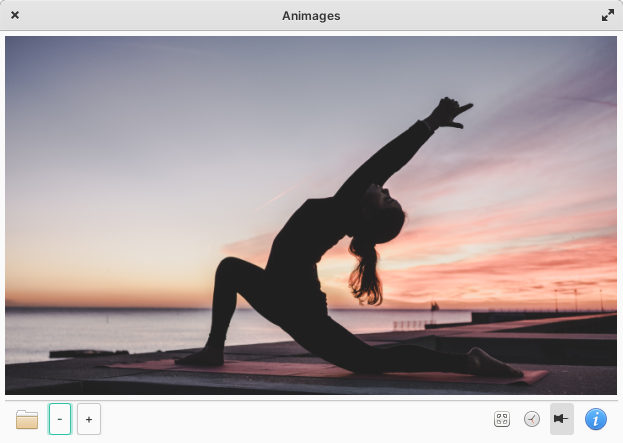

# Animage
<h1>Description:</h1>
Let your photos inspire your daily work.  
You can create a slideshow with your desktop theme or your personal photos 
<ul>
<li>Modify your timer</li>
<li>upload a new directory</li>
<li>Pin the widget to the desktop or keep it above all other windows</li> 
</ul>

 

<h1>Build and install</h1>

Download the last release (zip) et extract files 

<h2>Dependencies</h2>
These dependencies are needed for building :  
<pre>sudo apt-get install gcc valac gtk+-3.0 meson </pre/>

<h2>Build with meson/Construction:</h2>

Open a Terminal in the extracted folder, build your application with meson and install it with ninja: 

<pre>meson build --prefix=/usr
cd build
ninja
sudo ninja install
</pre>

<h1>Uninstall (need the extracted files)</h1>
In the previous folder ( /build) run the command : 

<code>sudo ninja uninstall</code>
